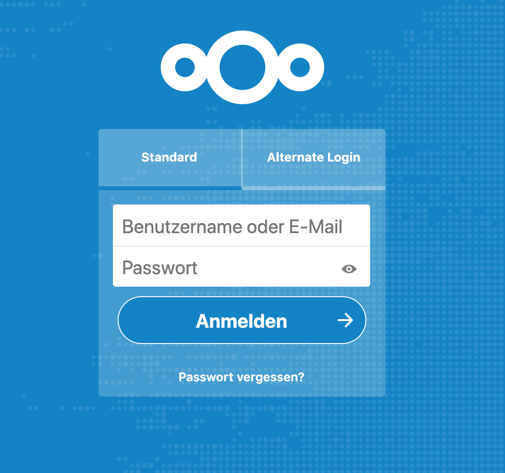
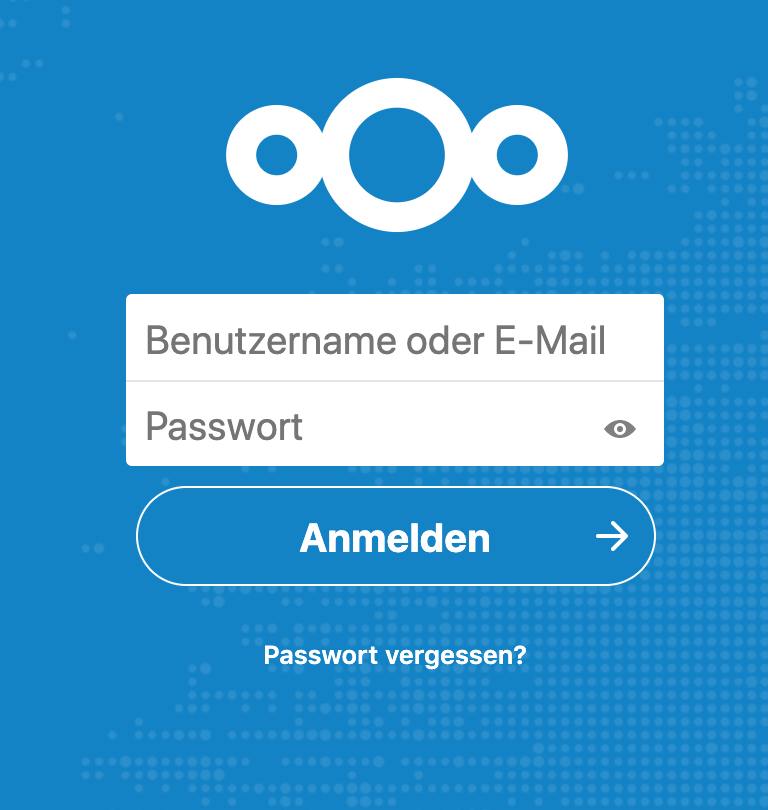

# Tab Login Theme

## Install

```
cd /var/www/nextcloud/themes
git clone https://github.com/ochorocho/nextcloud-theme-tablogin.git tablogin
```

Enable theme by adding `'theme' => 'tablogin',` in `config.php`.

## Configure

If you want to force the "Alternate Login" to be active for new users set `'alternate_login_force' => true,` in `config.php`.
Last active tab will be saved in a cookie.

## Preview

Tab view when a "Alternate Login" is configured:




When there is no "Alternate Login" configured:


